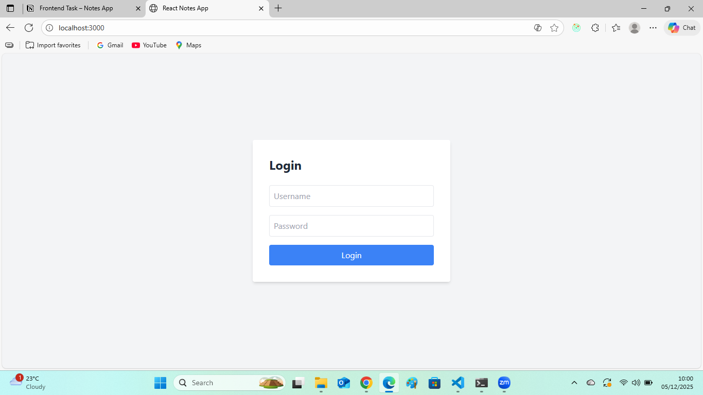
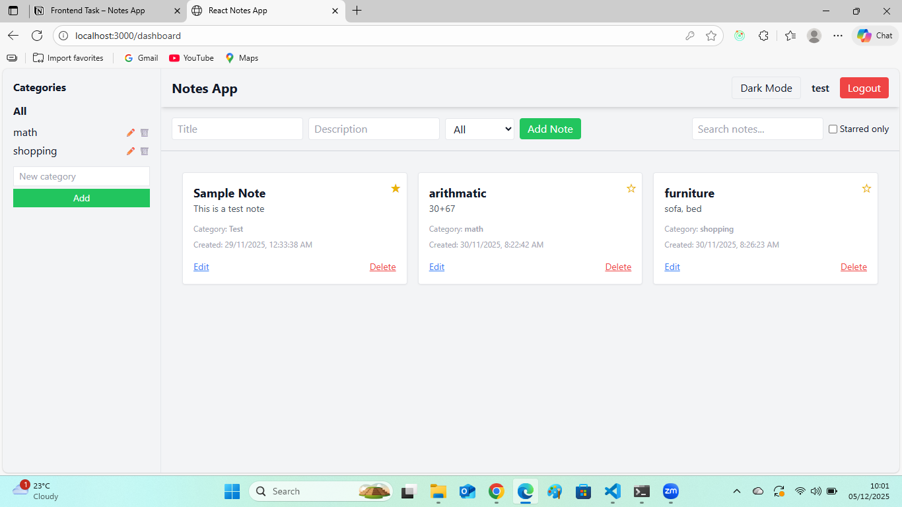
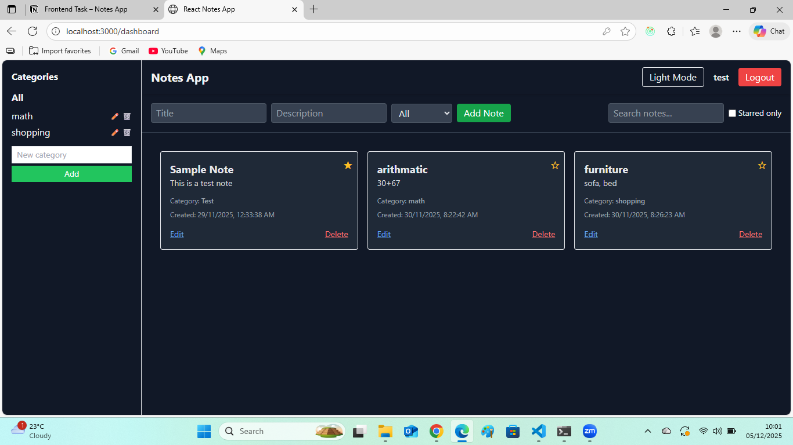

# 📝 React Notes App

A simple Notes Application built using **React, Redux Toolkit, and Tailwind CSS**.  
The app supports login authentication, notes management, categories, search, filters, starred notes, and dark mode.  
All data is stored in **LocalStorage**.

---

## 🚀 Features

- Frontend-only Login Authentication
- Add, Edit, Delete Notes
- Categories (Add, Edit, Delete)
- Assign Notes to Categories
- Star / Favorite Notes
- Search by Title & Description
- Filter by Category & Starred
- Light / Dark Mode
- Fully Responsive UI
- LocalStorage Persistence

---

## 🛠 Tech Stack

- React.js
- Redux Toolkit
- React Router
- Tailwind CSS
- LocalStorage

---

## ⚙️ Setup Instructions

```bash
git clone https://github.com/saruchi3031/React-notes-app.git
cd React-notes-app
npm install
npm start

## 📸 Screenshots

### 🔐 Login Page


### 🏠 Dashboard


### 🌙 Dark Mode



🎥 Demo Video

https://drive.google.com/file/d/1q6XdDoA1l56IJn89V7RsIG-YS3RR0IuI/view?usp=drive_link


🌍 Live Demo

https://fanciful-capybara-d9b8a7.netlify.app/
```
